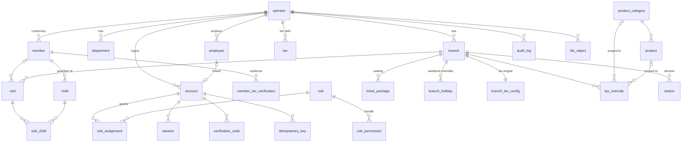

# OTO Platform — Architecture

Status: Sprint 1. This file restates the decisions from `CLAUDE.md` Section 3 (the source of the decisions), records the verified prototype layout, and logs decisions and deviations as they are made. Update it whenever a decision is made or changed.

---

## 1. What is being built

A ground-up rebuild of OTO Park's operations platform behind the **approved UI of the Replit prototype** (`/artifacts/oto-till`). The prototype is read-only reference; its frontend code is the primary source of business logic and is ported, not reinvented. All new code lives in `/oto-platform`.

## 2. Stack (decided — do not revisit)

| Concern | Decision |
|---|---|
| Language | TypeScript, strict mode, end to end |
| Monorepo | pnpm workspaces + Turborepo |
| API | Fastify 5 + `fastify-type-provider-zod`, OpenAPI generated from routes |
| Database | PostgreSQL 16, Drizzle ORM, Drizzle Kit forward-only migrations |
| POS frontend | React + Vite, carried over from the prototype — components and styles preserved |
| Admin / booking frontends | Later sprints (likely Next.js). Sprint 1 admin screens live in the ported POS `/admin` console |
| Local infra | Docker Compose: PostgreSQL 16 + MinIO |
| Validation | zod, shared via `packages/shared` |
| Auth | phone + password, argon2id, server-side sessions in httpOnly cookie |
| Logging | pino JSON, request IDs on every line |
| Testing | Vitest (unit + API integration), Playwright smoke flows |
| CI | GitHub Actions: install, typecheck, lint, test (Postgres service container), build, clean-migration check |

## 3. Monorepo layout

```
/oto-platform
  /apps
    /api            Fastify server (routes validate → services do the work → audit)
    /pos            React POS ported from /artifacts/oto-till
  /packages
    /db             Drizzle schema, migrations, seed, db client
    /shared         zod schemas, types, permission constants, money/phone/date utils, i18n scaffold
    /config         shared eslint / tsconfig / prettier
  /infra
    docker-compose.yml
  turbo.json
  pnpm-workspace.yaml
  package.json
  .env.example
  CLAUDE.md
  SPRINT_1_PROGRESS.md
  ARCHITECTURE.md   (this file)
```

## 4. Cross-cutting decisions

- **Multi-tenancy:** row-scoped, single schema. Tenant tables carry `operator_id`; branch-owned tables also carry `branch_id`. No schema-per-tenant.
- **IDs:** UUIDv7, Postgres `uuid`, generated in the application by one generator in `packages/shared` (keeps IDs client-generatable for the later offline queue).
- **Money:** integers in satang. Never floats. `Money` helper in `packages/shared`. (The prototype stores whole THB floats; values are converted ×100 at the port boundary.)
- **Time:** `timestamptz` UTC everywhere; each branch has a timezone (`Asia/Bangkok`); display conversion at the edge.
- **Phones:** E.164 on write via `libphonenumber-js`, default region `TH`. Uniqueness on the normalised value. (Replaces — and must match the observable behaviour of — the prototype's `phoneUtils.ts`: local Thai `0XXXXXXXXX` resolves to `+66…`.)
- **Soft deletion:** `archived_at timestamptz null`; no hard deletes of business records.
- **API style:** REST, JSON, resource-oriented. Error envelope `{ error: { code, message, details? } }`. Every mutating endpoint accepts `Idempotency-Key`.
- **Sessions:** opaque token (hashed at rest) in httpOnly SameSite cookie backed by a `session` table (expiry, last-seen, active branch, station). POS locks client-side after inactivity — prototype constants: **2 min timeout, 15 s warning** (`mockApi.ts` `INACTIVITY_TIMEOUT_MS` / `INACTIVITY_WARNING_MS`); unlock requires the password.
- **Permissions:** `service:resource:action` strings; roles are named bundles; role assignments carry a scope (operator / branch / department / record); effective permissions are the union across assignments. Fastify `preHandler` guard checks permission against the request's target scope. Resolver unit-tested across scope combinations.
- **Audit:** append-only `audit_log`; one `audit.record(...)` helper called from every mutating service. No exceptions.
- **Idempotency:** `idempotency_key` table (key, account, request hash, stored response, expiry). Same key + same hash → replay stored response; same key + different hash → 409. Plus DB unique constraints on business keys.
- **Files:** MinIO (S3 API), `file_object` metadata table, presigned PUT/GET issued only after a permission check. Nothing public.
- **Locale:** `packages/shared` owns phone/money/date helpers and the i18n scaffold. Customer-display language toggle wires to it.
- **Observability:** pino with request/account/branch IDs, `/health` + `/ready`, error hook that is a Sentry no-op unless `SENTRY_DSN` is set.
- **Offline (design-for, don't build):** idempotent write paths, client-generatable IDs, business logic in services not route handlers.

## 5. API reuse boundary (SCRUM-7 decision, restated)

- The stub `/artifacts/api-server` (Express, healthz only) is **not reused**. The new API is Fastify, built from scratch in `apps/api`.
- The prototype's `/lib/db`, `/lib/api-spec`, `/lib/api-zod`, `/lib/api-client-react` packages are **not reused** (template scaffolding, empty schema). `packages/db` and `packages/shared` are built fresh.
- The prototype's **UI and the business logic embedded in its frontend** are carried over:
  - `apps/pos` starts as a copy of `/artifacts/oto-till` (components, styles, routes intact).
  - Pure-logic modules under `src/lib/` (pricing, pricingMode, tax, membership, phone semantics) are the behavioural spec for the API's services; they are ported into `apps/api/src/services/*` and `packages/shared`, preserving edge cases, with the prototype file cited per ticket in `SPRINT_1_PROGRESS.md`.
  - `src/mockApi.ts` getters/mutators are the swap seam: Sprint 1 screens replace mock calls with API calls; out-of-scope screens keep the mock (Section 6 of `CLAUDE.md`).

## 6. Verified prototype layout (SCRUM-7)

Verified 2026-09-11 against the repo. Matches `CLAUDE.md` Section 2 with the following additions/corrections:

```
/artifacts/api-server        Express 5 stub — /api/healthz only; imports @workspace/db but uses nothing. NOT reused.
/artifacts/mockup-sandbox    design sandbox (component preview harness). Reference only.
/artifacts/oto-till          THE prototype: React 19 + Vite 7 + Tailwind 4, wouter, ~79k LOC, 316 files.
  src/mockApi.ts               5,835 lines — ALL mock data + getters/mutators (the swap seam)
  src/store/catalogStore.ts    1,805 lines — editable per-branch catalog (admin writes, POS reads)
  src/types.ts                 2,047 lines — single source of truth for shapes
  src/lib/*                    36 pure-logic modules (pricing, tax, membership, phone, …)
  src/pages/*                  12 routes; src/components/* organised per surface; components/mobile/* = separate phone UI
/attached_assets             images and pasted task briefs
/lib                         db / api-spec / api-zod / api-client-react — template scaffolding, NOT reused
/scripts                     post-merge hook + hello script
/replit.md                   prototype's own agent notes (read)
/.agents/memory/*            27 architecture-decision notes from the prototype's development — valuable reference
pnpm-workspace.yaml          prototype workspace; strips non-Linux native binaries (Windows dev needs manual binaries)
```

Prototype runs at `http://localhost:25731` with required env `PORT` + `BASE_PATH` (PowerShell on Windows; Git Bash mangles `BASE_PATH=/`).

## 7. Glossary — one naming trap

| Term | In `CLAUDE.md` / new schema | In the prototype code |
|---|---|---|
| **Operator** | The **tenant** (the company, e.g. "OTO") | The **logged-in staff member** (`Operator` type, `OperatorContext`, "operator stamps") |

New code uses **operator = tenant** and **account / employee = staff**. When porting prototype code, every prototype `Operator`/`operatorId` reference maps to **account** (the acting staff account). Do not let the two meanings mix in the schema or services.

## 8. Entity diagram (SCRUM-10)

Core Sprint 1 entities (future-milestone tables — booking, transaction, wallet, wristband, stock — exist with minimal columns and hang off operator/branch/member the same way):



Key shapes inside jsonb (validated by `@oto/shared` zod schemas at the API boundary):
- `ticket_package.prices` — `Record<tierCode, {weekday, weekend}>` satang (D1)
- `ticket_package.adult_rules` — `Record<tierCode, TierAdultRule>` (`same_as_kid` / `set_price` / `free_adults`+overflow)
- `ticket_package.tier_pricing` / `freebies` / `credit_rule` / `translations` — prototype shapes verbatim
- `branch_tax_config.config` — the prototype tax engine: `{rates[], categoryRules[], discountPlacement}` (D3)

## 9. Idempotency pattern (SCRUM-15)

Every mutating route accepts an `Idempotency-Key` header. The middleware hashes `method + url + body`; under `(account_id, key)`:
- first sighting → the handler runs and its `{status, body}` is stored with the request hash and a TTL (`IDEMPOTENCY_TTL_HOURS`, default 24h);
- same key + same hash → the stored response is replayed without re-running the handler;
- same key + different hash → `409 IDEMPOTENCY_MISMATCH`;
- same key while the original is still in flight → `409 IDEMPOTENCY_IN_FLIGHT`.

This sits ON TOP of database unique constraints on business keys (`member(operator_id, phone)`, `account(operator_id, phone)`, `branch(operator_id, code)`), so replay protection never substitutes for real uniqueness. Payments/wallets/redemptions in later sprints inherit the same middleware unchanged.

## 10. Deviations & decisions log

| # | Date | Decision | Why |
|---|---|---|---|
| D1 | 2026-09-11 | Ticket pricing schema will follow the prototype's shape — per-tier `{weekday, weekend}` kid prices plus per-tier adult rules (`same_as_kid` / `set_price` / `free_adults` + overflow) — rather than the flat `kid_price_*` / `adult_price_*` / `included_adults` / `overflow_adult_price` columns sketched in `CLAUDE.md` §4. | Order of authority: the prototype's approved pricing logic (`lib/pricing.ts`) cannot be expressed in the flat columns. §4 says "add what the prototype's data shapes require". Raised at CP1; final shape reviewed at CP2. |
| D2 | 2026-09-11 | Tiers are **data** (per-operator `tier` table seeded tourist/expat/thai, `is_default`, `requires_verification`), not a Postgres enum. `member.tier` references the tier id, default = the default tier. | Prototype tiers are admin-editable config (`TierDef`, `catalogStore`). Enum would contradict approved behaviour. |
| D3 | 2026-09-11 | Tax schema follows the prototype's engine: named rate table + per-category rules (mode inclusive/exclusive/none, service charge %, tax-on-service, optional secondary tax) + discount placement — with `CLAUDE.md`'s `branch_tax_rule`/`tax_override` realised as views of that model (branch default = the per-category rules; overrides per category/product per §4). | Prototype `lib/tax.ts` + `TaxConfig` is the approved accountant-specified engine; the flat `vat_rate_bp` columns cannot express it. Raised at CP1; reviewed at CP2. |
| D4 | 2026-09-11 | i18n scaffold ships `en` + `th` message files per `CLAUDE.md`, but the ported POS keeps its existing five customer-display languages (en, zh, th, ru, fr) rendering from the prototype dictionary until translations move into the scaffold. | Prototype has 5 languages; §7 forbids UI changes. `CLAUDE.md` names only en/th for the scaffold — flagged as a CP1 question. |
| D5 | 2026-09-11 | `included_adults` semantics: the prototype's `free_adults` count applies **per cart line** (per ticket line, not multiplied per child) — `resolveAdultLine` in `lib/pricing.ts:42`. The §11 assumption "counted per child ticket" is corrected accordingly. | §11 instructs: check the prototype first; prototype wins. |
| D6 | 2026-09-11 | `tier` rows are **operator-scoped** (member.tier applies across branches); the prototype clones identical tiers per branch inside its per-branch catalog. Member tier codes are soft references to `tier.code`. | A member's verified tier must hold at every branch; per-branch tier tables would fork it. |
| D7 | 2026-09-11 | Sign-in throttling: per-phone lockout at `AUTH_MAX_FAILURES` (5), per-IP at 4× that, in-memory. | Many tills share one reception IP; a single guessed phone must not lock the whole branch out. In-memory resets only relax the limit. |
| D8 | 2026-09-11 | The customer-display → till membership lookup travels via `session.pending_lookup_phone` (PUT stage / POST consume, 30 s TTL) — the "short-lived pending lookup on the session" from CLAUDE.md §7.4. | Both halves of the split-screen harness share the till's session; a station-scoped channel replaces it when the display becomes a separate device (M2+). |
| D9 | 2026-09-11 | Public /book endpoints (client-requested Sprint 1 extension): unauthenticated catalog, phone → {nickname, tier} self-identification, and booking creation with the total recomputed server-side (shared pricing port). The member-tier endpoint deliberately returns no children or other PII, and the online tier claim is re-verified at the door per the prototype rule. | The customer site must price by tier and persist bookings without a staff session; trusting a client-computed total or exposing member PII publicly was never acceptable. |
| D10 | 2026-09-11 | The i18n scaffold carries all five customer languages (en/zh/th/ru/fr) with the real prototype strings, and every seeded package ships name+description translations in all five. | Client instruction supersedes the brief's en/th scaffold: "all 5 languages processed and translations working, not placeholders" (extends Q2/D4). |
