# OTO Platform — Architecture

Status: Sprint 2, from ticket S2-01b. This file restates the decisions from `CLAUDE.md` Section 3 (the source of the decisions), records the verified prototype layout, and logs decisions and deviations as they are made. Update it whenever a decision is made or changed.

Sections 1–7 are the Sprint 1 decisions and still hold. Section 8 (the database schemas and the entity diagram) and section 9 (ids and idempotency) were rewritten in S2-01b; sections 11–15 describe the rules the API now runs under — transactions, administrative access control, the session lock model, route guards and log redaction — and are the part to read before writing a route or a service.

---

## 1. What is being built

A ground-up rebuild of OTO Park's operations platform behind the **approved UI of the Replit prototype** (`/artifacts/oto-till`). The prototype is read-only reference; its frontend code is the primary source of business logic and is ported, not reinvented. All new code lives in `/oto-platform`.

## 2. Stack (decided — do not revisit)

| Concern | Decision |
|---|---|
| Language | TypeScript, strict mode, end to end |
| Monorepo | pnpm workspaces + Turborepo |
| API | Fastify 5 + `fastify-type-provider-zod`, OpenAPI generated from routes |
| Database | PostgreSQL 16, Drizzle ORM, Drizzle Kit forward-only migrations |
| POS frontend | React + Vite, carried over from the prototype — components and styles preserved |
| Admin / booking frontends | Later sprints (likely Next.js). Sprint 1 admin screens live in the ported POS `/admin` console |
| Local infra | Docker Compose: PostgreSQL 16 + MinIO |
| Validation | zod, shared via `packages/shared` |
| Auth | phone + password, argon2id, server-side sessions in httpOnly cookie |
| Logging | pino JSON, request IDs on every line |
| Testing | Vitest (unit + API integration), Playwright smoke flows |
| CI | GitHub Actions: install, typecheck, lint, test (Postgres service container), build, clean-migration check |

## 3. Monorepo layout

```
/oto-platform
  /apps
    /api            Fastify server (routes validate → services do the work → audit)
    /pos            React POS ported from /artifacts/oto-till
  /packages
    /db             Drizzle schema, migrations, seed, db client
    /shared         zod schemas, types, permission constants, money/phone/date utils, i18n scaffold
    /config         shared eslint / tsconfig / prettier
  /infra
    docker-compose.yml
  turbo.json
  pnpm-workspace.yaml
  package.json
  .env.example
  CLAUDE.md
  SPRINT_1_PROGRESS.md
  ARCHITECTURE.md   (this file)
```

## 4. Cross-cutting decisions

- **Multi-tenancy:** row-scoped, single schema. Tenant tables carry `operator_id`; branch-owned tables also carry `branch_id`. No schema-per-tenant.
- **IDs:** UUIDv7, Postgres `uuid`, generated in the application by one generator in `packages/shared` (keeps IDs client-generatable for the later offline queue).
- **Money:** integers in satang. Never floats. `Money` helper in `packages/shared`. (The prototype stores whole THB floats; values are converted ×100 at the port boundary.)
- **Time:** `timestamptz` UTC everywhere; each branch has a timezone (`Asia/Bangkok`); display conversion at the edge.
- **Phones:** E.164 on write via `libphonenumber-js`, default region `TH`. Uniqueness on the normalised value. (Replaces — and must match the observable behaviour of — the prototype's `phoneUtils.ts`: local Thai `0XXXXXXXXX` resolves to `+66…`.)
- **Soft deletion:** `archived_at timestamptz null`; no hard deletes of business records.
- **API style:** REST, JSON, resource-oriented. Error envelope `{ error: { code, message, details? } }`. Every mutating endpoint accepts `Idempotency-Key`.
- **Sessions:** opaque token (hashed at rest) in httpOnly SameSite cookie backed by a `session` table (expiry, last-seen, active branch, station). POS locks client-side after inactivity — prototype constants: **2 min timeout, 15 s warning** (`mockApi.ts` `INACTIVITY_TIMEOUT_MS` / `INACTIVITY_WARNING_MS`); unlock requires the password.
- **Permissions:** `service:resource:action` strings; roles are named bundles; role assignments carry a scope (operator / branch / department / record); effective permissions are the union across assignments. Fastify `preHandler` guard checks permission against the request's target scope. Resolver unit-tested across scope combinations.
- **Audit:** append-only `audit_log`; one `audit.record(...)` helper called from every mutating service. No exceptions.
- **Idempotency:** `idempotency_key` table (key, account, request hash, stored response, expiry). Same key + same hash → replay stored response; same key + different hash → 409. Plus DB unique constraints on business keys.
- **Files:** MinIO (S3 API), `file_object` metadata table, presigned PUT/GET issued only after a permission check. Nothing public.
- **Locale:** `packages/shared` owns phone/money/date helpers and the i18n scaffold. Customer-display language toggle wires to it.
- **Observability:** pino with request/account/branch IDs, `/health` + `/ready`, error hook that is a Sentry no-op unless `SENTRY_DSN` is set.
- **Offline:** idempotent write paths, client-generatable IDs and business logic in services. The current implemented boundary is recorded in section 17; a box primitive is not a working offline till flow.

## 5. API reuse boundary (SCRUM-7 decision, restated)

- The stub `/artifacts/api-server` (Express, healthz only) is **not reused**. The new API is Fastify, built from scratch in `apps/api`.
- The prototype's `/lib/db`, `/lib/api-spec`, `/lib/api-zod`, `/lib/api-client-react` packages are **not reused** (template scaffolding, empty schema). `packages/db` and `packages/shared` are built fresh.
- The prototype's **UI and the business logic embedded in its frontend** are carried over:
  - `apps/pos` starts as a copy of `/artifacts/oto-till` (components, styles, routes intact).
  - Pure-logic modules under `src/lib/` (pricing, pricingMode, tax, membership, phone semantics) are the behavioural spec for the API's services; they are ported into `apps/api/src/services/*` and `packages/shared`, preserving edge cases, with the prototype file cited per ticket in `SPRINT_1_PROGRESS.md`.
  - `src/mockApi.ts` getters/mutators are the swap seam: Sprint 1 screens replace mock calls with API calls; out-of-scope screens keep the mock (Section 6 of `CLAUDE.md`).

## 6. Verified prototype layout (SCRUM-7)

Verified 2026-09-11 against the repo. Matches `CLAUDE.md` Section 2 with the following additions/corrections:

```
/artifacts/api-server        Express 5 stub — /api/healthz only; imports @workspace/db but uses nothing. NOT reused.
/artifacts/mockup-sandbox    design sandbox (component preview harness). Reference only.
/artifacts/oto-till          THE prototype: React 19 + Vite 7 + Tailwind 4, wouter, ~79k LOC, 316 files.
  src/mockApi.ts               5,835 lines — ALL mock data + getters/mutators (the swap seam)
  src/store/catalogStore.ts    1,805 lines — editable per-branch catalog (admin writes, POS reads)
  src/types.ts                 2,047 lines — single source of truth for shapes
  src/lib/*                    36 pure-logic modules (pricing, tax, membership, phone, …)
  src/pages/*                  12 routes; src/components/* organised per surface; components/mobile/* = separate phone UI
/attached_assets             images and pasted task briefs
/lib                         db / api-spec / api-zod / api-client-react — template scaffolding, NOT reused
/scripts                     post-merge hook + hello script
/replit.md                   prototype's own agent notes (read)
/.agents/memory/*            27 architecture-decision notes from the prototype's development — valuable reference
pnpm-workspace.yaml          prototype workspace; strips non-Linux native binaries (Windows dev needs manual binaries)
```

Prototype runs at `http://localhost:25731` with required env `PORT` + `BASE_PATH` (PowerShell on Windows; Git Bash mangles `BASE_PATH=/`).

## 7. Glossary — one naming trap

| Term | In `CLAUDE.md` / new schema | In the prototype code |
|---|---|---|
| **Operator** | The **tenant** (the company, e.g. "OTO") | The **logged-in staff member** (`Operator` type, `OperatorContext`, "operator stamps") |

New code uses **operator = tenant** and **account / employee = staff**. When porting prototype code, every prototype `Operator`/`operatorId` reference maps to **account** (the acting staff account). Do not let the two meanings mix in the schema or services.

## 8. Database schemas and entity diagram (SCRUM-10, S2-01b)

### 8.1 The schema map

One database holds the whole suite. The boundary between its parts is a Postgres **schema** rather than a naming convention, so that a grant, a dump or a `search_path` can address one area on its own, and so that a lifted application brought onto the same database later — the OTO App, Radar, the Inbox — can keep its own tables beside ours without a single name collision. `packages/db` owns seven schemas, declared in `packages/db/src/schema/helpers.ts` and listed there as `OWNED_SCHEMAS`. Drizzle table objects are still imported by name from `@oto/db`; only the SQL is qualified.

| Schema | What lives there |
|---|---|
| `core` | Tenancy and fleet — `operator`, `branch`, `department`, `employee`, `account`, `role`, `role_permission`, `role_assignment`, `session`, `verification_code`, `station` — and the platform's own records: `audit_log`, `idempotency_key`, `file_object`, `auth_throttle`. |
| `crm` | The customer: `tier`, `member`, `member_tier_verification`, `child`, `visit`, `visit_child`. |
| `pos` | What the till sells and the money it takes: the catalogue (`ticket_package`, `branch_holiday`, `branch_tax_config`, `product_category`, `product`, `tax_override`), `booking` and `attendee`, `sale` and `sale_line`, `payment_attempt`, `wallet` and `wallet_entry`, `band`, `stock_item`, `stock_location`, `stock_level`. |
| `promo` | Vouchers, redemptions, campaigns. Empty until the tickets that fill it. |
| `booth` | The Lucky Wheel. Empty. |
| `analytics` | Summaries and facts the reporting app reads. Empty. |
| `edge` | Box-owned state and the sync ledger for the on-site boxes. Empty. |

Placement is by **owner**, not by lifecycle: a table lives with the part of the business that is responsible for its rows, not with the tables that happen to be written at the same moment. Two placements the plan left open were settled here:

- **The catalogue sits in `pos`.** A ticket package, the holiday calendar that switches its pricing and the tax rules applied to it are only ever read together, and only by the till and by the admin screens that configure the till. A separate configuration schema would put one read across two boundaries and buy nothing back.
- **`tier` sits in `crm`, not with the catalogue that prices by it.** A tier is what a person *is* — the thing a member is verified as, and a verification that holds at every branch (D6). The catalogue only refers to `tier.code` when it works out a price.

Nothing of ours is left in `public`. Schemas other tools own — `pgboss`, created by the job runner's own migrator, and `otoapp`, `radar`, `inbox` for the lifted applications — are deliberately excluded by `schemaFilter` in `packages/db/drizzle.config.ts`, so a Drizzle diff never offers to drop them.

### 8.2 Names and types settled in the same move

`migrations/0005_schema_move.sql` moved every table with `ALTER TABLE … SET SCHEMA`, which preserves the rows, and took the names the rest of the sprint uses while those tables were still empty: `transaction` → `sale`, `transaction_line` → `sale_line`, `payment` → `payment_attempt`, `wristband` → `band`, `item` → `stock_item`, with the foreign-key columns renamed to match. Postgres does not rename a constraint or an index when its table is renamed, so the migration renames those by hand as well.

The seven Postgres enums became `text` columns with a `CHECK`. Adding a value to a Postgres enum takes a DDL lock and cannot happen in a transaction that also reads the type; a `CHECK` is replaced in one statement, and the database still enforces the set.

A move between schemas is one of the few things `drizzle-kit generate` cannot express — it answers with `DROP` + `CREATE`, which would throw the rows away — so 0005 is hand-written and two scripts stand behind it. `pnpm --filter @oto/db snapshot <tag>` writes the matching Drizzle snapshot without the CLI's interactive rename prompts, and `pnpm --filter @oto/db verify-schema` builds a throwaway database from the committed migrations, runs them a second time to prove they are a no-op, and compares the live catalogue with the snapshot: tables, columns, nullability, foreign-key names *and* their `ON DELETE`, indexes and their uniqueness, and check constraints. It fails if any table of ours is found in `public`. See `CONTRIBUTING.md` for when each of those is required.

### 8.3 Entity diagram

The Sprint 1 entities plus the sales chain the rest of Sprint 2 fills. Tables that are still empty (`pos.booking` onwards) carry minimal columns and hang off operator, branch and member the same way the others do.

```mermaid
erDiagram
    "core.operator" ||--o{ "core.branch" : has
    "core.operator" ||--o{ "core.department" : has
    "core.operator" ||--o{ "core.employee" : employs
    "core.operator" ||--o{ "core.account" : "logins"
    "core.operator" ||--o{ "crm.member" : "customers"
    "core.operator" ||--o{ "crm.tier" : "tier defs"
    "core.employee" |o--o| "core.account" : "linked"
    "core.account" ||--o{ "core.role_assignment" : "grants"
    "core.role" ||--o{ "core.role_assignment" : ""
    "core.role" ||--o{ "core.role_permission" : "bundle"
    "core.account" ||--o{ "core.session" : ""
    "core.account" ||--o{ "core.verification_code" : ""
    "crm.member" ||--o{ "crm.child" : "guardian of"
    "crm.member" ||--o{ "crm.member_tier_verification" : "evidence"
    "crm.member" |o--o{ "crm.visit" : ""
    "core.branch" ||--o{ "crm.visit" : ""
    "crm.visit" ||--o{ "crm.visit_child" : ""
    "crm.child" ||--o{ "crm.visit_child" : ""
    "core.branch" ||--o{ "pos.ticket_package" : "catalogue"
    "core.branch" ||--o{ "pos.branch_holiday" : "weekend overrides"
    "core.branch" ||--|| "pos.branch_tax_config" : "tax engine"
    "core.branch" ||--o{ "pos.tax_override" : ""
    "pos.product_category" ||--o{ "pos.product" : ""
    "pos.product_category" |o--o{ "pos.tax_override" : "scoped to"
    "pos.product" |o--o{ "pos.tax_override" : "scoped to"
    "core.operator" ||--o{ "core.station" : "devices"
    "core.branch" ||--o{ "core.station" : "sited at"
    "core.operator" ||--o{ "core.audit_log" : ""
    "core.account" ||--o{ "core.idempotency_key" : ""
    "core.operator" ||--o{ "core.file_object" : ""
    "core.branch" ||--o{ "pos.booking" : ""
    "pos.booking" ||--o{ "pos.attendee" : ""
    "core.branch" ||--o{ "pos.sale" : "rings up"
    "crm.member" |o--o{ "pos.sale" : ""
    "pos.sale" ||--o{ "pos.sale_line" : ""
    "pos.sale" ||--o{ "pos.payment_attempt" : "attempts"
    "crm.member" |o--o| "pos.wallet" : ""
    "pos.wallet" ||--o{ "pos.wallet_entry" : "ledger"
    "core.branch" ||--o{ "pos.band" : "issued at"
    "pos.stock_location" ||--o{ "pos.stock_level" : ""
    "pos.stock_item" ||--o{ "pos.stock_level" : ""
```



A ledger is never deleted out from under itself and a child's record is never deleted with its guardian: `crm.child → crm.member` is `ON DELETE RESTRICT`, and `pos.sale_line`, `pos.payment_attempt` and `pos.wallet_entry` lost the cascade they were created with. A delete that would take those rows with it now fails loudly instead.

Key shapes inside jsonb (validated by `@oto/shared` zod schemas at the API boundary):
- `ticket_package.prices` — `Record<tierCode, {weekday, weekend}>` satang (D1)
- `ticket_package.adult_rules` — `Record<tierCode, TierAdultRule>` (`same_as_kid` / `set_price` / `free_adults`+overflow)
- `ticket_package.tier_pricing` / `freebies` / `credit_rule` / `translations` — prototype shapes verbatim
- `branch_tax_config.config` — the prototype tax engine: `{rates[], categoryRules[], discountPlacement}` (D3)

## 9. Ids and idempotency (SCRUM-15, hardened in S2-01b)

A till on a mall connection retries. Without the two mechanisms below, a retry is a second member, a second visit, a second sale.

**Ids are minted by the client, not by the database.** Every primary key is a UUIDv7 produced by `newId()` in `@oto/shared`. The application generates it, so a till knows the id of the thing it is about to create before it has a connection to send it over — which is what the later offline queue is built on — and a create can therefore be repeated safely. `POST /members` takes the id in the body: if that row already exists inside the caller's operator, the existing member comes back with an `x-oto-replay: true` header instead of a second member being created. UUIDv7 is time-ordered, so the primary-key index stays append-mostly despite being random-looking.

**`Idempotency-Key` covers the rest.** Every mutating route accepts the header; the plugin (`apps/api/src/plugins/idempotency.ts`) hashes `method + url + body` and works under `(account_id, key)` — the account is the principal today, and a box or station credential becomes a principal of its own when the boxes arrive.

- The key is **claimed atomically**, in a single `insert … on conflict do nothing returning`, so two racing retries cannot both decide they are first. Sprint 1 read the row and then wrote it, which is exactly that race.
- Same key, same request, response already stored → the stored `{status, body}` is replayed verbatim with `x-oto-replay: true`, and the handler does not run.
- Same key, different request → `409 IDEMPOTENCY_MISMATCH`.
- Same key while the original is **still running** → `409 IDEMPOTENCY_IN_FLIGHT` with `Retry-After: 1`. The answer tells the client to poll the same key rather than send the work again, which is the difference between waiting for a sale and ringing up two.
- A **5xx releases the claim**: the row is deleted on the way out, so the next attempt does the work instead of replaying a server fault for the rest of the day.
- A key whose window has passed is taken over by the next claim, again atomically. `IDEMPOTENCY_TTL_HOURS` (default 24) sets the window; `purgeExpiredIdempotencyKeys` clears the rows in bulk for housekeeping.

Where a handler runs inside `withTx` (section 11) the stored response is written **in that same transaction**, so "the work happened" and "this is what we answered" commit together and a crash between the two cannot leave a retry re-running work that already succeeded. Where a handler reads its response back after the commit, the `onSend` hook stores it instead, and the client-minted id covers the gap.

All of this sits **on top of** database unique constraints on business keys (`member(operator_id, phone)`, `account(operator_id, phone)`, `branch(operator_id, code)`): replay protection never substitutes for real uniqueness, and the two paths answer with the same error code when they race (section 15). The header cache is an online convenience with a one-day memory; the money path, when it arrives, rests on the client-minted entity id rather than on the header alone.

## 10. Deviations & decisions log

| # | Date | Decision | Why |
|---|---|---|---|
| D1 | 2026-09-11 | Ticket pricing schema will follow the prototype's shape — per-tier `{weekday, weekend}` kid prices plus per-tier adult rules (`same_as_kid` / `set_price` / `free_adults` + overflow) — rather than the flat `kid_price_*` / `adult_price_*` / `included_adults` / `overflow_adult_price` columns sketched in `CLAUDE.md` §4. | Order of authority: the prototype's approved pricing logic (`lib/pricing.ts`) cannot be expressed in the flat columns. §4 says "add what the prototype's data shapes require". Raised at CP1; final shape reviewed at CP2. |
| D2 | 2026-09-11 | Tiers are **data** (per-operator `tier` table seeded tourist/expat/thai, `is_default`, `requires_verification`), not a Postgres enum. `member.tier` references the tier id, default = the default tier. | Prototype tiers are admin-editable config (`TierDef`, `catalogStore`). Enum would contradict approved behaviour. |
| D3 | 2026-09-11 | Tax schema follows the prototype's engine: named rate table + per-category rules (mode inclusive/exclusive/none, service charge %, tax-on-service, optional secondary tax) + discount placement — with `CLAUDE.md`'s `branch_tax_rule`/`tax_override` realised as views of that model (branch default = the per-category rules; overrides per category/product per §4). | Prototype `lib/tax.ts` + `TaxConfig` is the approved accountant-specified engine; the flat `vat_rate_bp` columns cannot express it. Raised at CP1; reviewed at CP2. |
| D4 | 2026-09-11 | i18n scaffold ships `en` + `th` message files per `CLAUDE.md`, but the ported POS keeps its existing five customer-display languages (en, zh, th, ru, fr) rendering from the prototype dictionary until translations move into the scaffold. | Prototype has 5 languages; §7 forbids UI changes. `CLAUDE.md` names only en/th for the scaffold — flagged as a CP1 question. |
| D5 | 2026-09-11 | `included_adults` semantics: the prototype's `free_adults` count applies **per cart line** (per ticket line, not multiplied per child) — `resolveAdultLine` in `lib/pricing.ts:42`. The §11 assumption "counted per child ticket" is corrected accordingly. | §11 instructs: check the prototype first; prototype wins. |
| D6 | 2026-09-11 | `tier` rows are **operator-scoped** (member.tier applies across branches); the prototype clones identical tiers per branch inside its per-branch catalog. Member tier codes are soft references to `tier.code`. | A member's verified tier must hold at every branch; per-branch tier tables would fork it. |
| D7 | 2026-09-11 | Sign-in throttling: per-phone lockout at `AUTH_MAX_FAILURES` (5), per-IP at 4× that, in-memory. | Many tills share one reception IP; a single guessed phone must not lock the whole branch out. In-memory resets only relax the limit. |
| D8 | 2026-09-11 | The customer-display → till membership lookup travels via `session.pending_lookup_phone` (PUT stage / POST consume, 30 s TTL) — the "short-lived pending lookup on the session" from CLAUDE.md §7.4. | Both halves of the split-screen harness share the till's session; a station-scoped channel replaces it when the display becomes a separate device (M2+). |
| D9 | 2026-09-11 | Public /book endpoints (client-requested Sprint 1 extension): unauthenticated catalog, phone → {nickname, tier} self-identification, and booking creation with the total recomputed server-side (shared pricing port). The member-tier endpoint deliberately returns no children or other PII, and the online tier claim is re-verified at the door per the prototype rule. | The customer site must price by tier and persist bookings without a staff session; trusting a client-computed total or exposing member PII publicly was never acceptable. |
| D10 | 2026-09-11 | The i18n scaffold carries all five customer languages (en/zh/th/ru/fr) with the real prototype strings, and every seeded package ships name+description translations in all five. | Client instruction supersedes the brief's en/th scaffold: "all 5 languages processed and translations working, not placeholders" (extends Q2/D4). |
| D11 | 2026-09-29 | New tender starts refuse configured disabled or archived methods. Declared-kind fallback is retained only when no method row exists; a live replacement wins over archived history (SCRUM-382). | Preserves older-catalogue classification without letting a till bypass an explicit availability setting. Existing accepted attempts still settle. An unavailable method on offline replay retains the signed fact in quarantine for correction and Console Replay, rather than partially recording or discarding money. |

(The log stays at section 10 so that the references to "§10" elsewhere keep working. The sections below were added after it.)

## 11. Transactions — one operation, one transaction (S2-01b)

Sprint 1 wrote the row and then the audit entry as two separate statements. A crash between them left a change nobody could account for, and a half-finished multi-table write left the database describing something that never happened. Everything a single operation does now happens inside `withTx(db, ctx, opName, fn)` — `apps/api/src/services/tx.ts` — and commits together or not at all.

The rule the audit trail depends on has two halves, and they are deliberately asymmetric:

- The **success** row is written **inside** the transaction, by the service, on the `tx` handle. It therefore cannot survive a rollback. An audit row describing a change that was rolled back is worse than no audit row at all.
- The **failure** row is written **after** the rollback, on a separate connection from the pool, because by definition it has to outlive the transaction that failed. It is `<opName>.failed` against entity type `operation`, and it carries a short error code only — never the error's own text, which can contain the values that caused it. If even that write fails it is logged and the original error is still thrown: the record of a failure never replaces the failure.

`opName` is the audit action vocabulary — `member.create`, `visit.create`, `role_assignment.delete` — so one name ties the log line, the audit row and the operation together, and the failure row is that name with `.failed` on the end.

What a service is expected to do:

- **Take `Exec`, not `Db`.** `Exec` is "the pool, or a transaction on it", so the same function works standalone and inside a `withTx`. That is what lets one operation stay one transaction when a route composes two services.
- **Write only on the handle it was given.** A write issued against `app.db` from inside a `withTx` callback runs on a different connection, outside the transaction, and will not roll back with it. This is the mistake to watch for in review.
- **Record its own audit row**, with `audit.record(tx, …)` on the same handle, as the last thing it does.
- **Validate before it writes.** Roles are resolved before the account row is inserted, for instance, so an unknown role cannot leave an orphaned account behind.
- **Be safe to run twice**, because the caller may retry (section 9).

`apps/api/test/transactions.test.ts` proves the rule rather than asserting it. It installs a Postgres trigger that raises on the audit insert for one named action, so the failure happens *inside* the transaction, after everything the handler wrote — exactly the case the rule exists for. Creating an account, a visit and a public booking each roll back completely, leaving no row and no `create` audit entry, while the `.failed` entry survives in every case.

## 12. Administrative access control — tenancy, scope, dominance (S2-01a)

Sprint 1 checked only that the caller held `admin:role:assign`. Any holder, a branch manager included, could grant `platform_admin` platform-wide, reset the operator administrator's password, or act on an account belonging to another operator. `apps/api/src/services/access-control.ts` closes that with three rules, applied **in this order**:

1. **Tenancy.** The target account must belong to the caller's operator. Anything else is `404 ACCOUNT_NOT_FOUND`, never 403 — a 403 would confirm that the id exists, and the existence of another operator's account is not ours to disclose.
2. **Scope ownership.** A branch or department named in a scope must belong to the caller's operator, and the platform-wide scope (scope type `operator` with a null scope id) may only be used by a caller who already holds permissions platform-wide. Refusals are `403 SCOPE_NOT_OWNED`.
3. **Dominance.** You cannot grant what you do not hold. The caller must hold *every* permission the role carries, at a scope that covers the scope being granted, or the grant is `403 ROLE_NOT_DOMINATED`. The same test guards destructive actions on an account that already exists: to deactivate it, change its phone, issue it a temporary password or read its permissions, the caller must dominate every role that account already holds.

**Why the platform-wide scope is refused by rule 2, before rule 3 is weighed.** Both rules would refuse it, so the order looks like a detail. It is not, for three reasons.

The first is that the answer has to be true. Weighing dominance first answers `ROLE_NOT_DOMINATED` and names a permission, which reads as an instruction — obtain that permission and the grant will go through. It will not. No permission held inside an operator ever authorises a platform-wide grant, because the question is not which permissions the caller holds but whether that scope is theirs to use at all. `SCOPE_NOT_OWNED` says the true thing.

The second is that rule 2 decides which dominance test applies. For an ordinary scope, dominance asks whether the caller holds each permission at a covering scope. For a platform-wide grant it asks something stricter: the caller must hold the permission at `operator`/null specifically, not merely somewhere inside an operator. Running the check before the scope has been established would run the wrong one.

The third is cost: rule 2 needs the caller's effective permissions, which are already resolved for the request, while rule 3 needs the role's whole permission list from the database.

## 13. The lock model (S2-01a)

Three different things can suspend or end a session, and conflating them is how audit trails go missing.

- **Lock** — `session.locked_at`. The POS locks itself after inactivity (timings in `apps/pos/src/auth/timings.ts`). The session row survives untouched: it is still a valid session, it simply may do no business. `requireAuth` refuses everything outside a short exempt list — sign-out, lock, unlock, change-password, `GET /me`, `GET /me/permissions` — with `423 SESSION_LOCKED`, and a 423 from any call puts the POS into its locked screen, which names who is signed in and asks only for the password. Unlocking re-verifies that password against the *same* session, under the sign-in throttle. The checks live in `requireAuth` rather than only in `requirePermission`, because otherwise a route that needs nothing but a session would be reachable from a locked till.
- **Revoke** — `session.revoked_at` and `revoked_reason`. Signing out, and "sign out everywhere", revoke rather than delete, so who ended a session, when and why stays answerable afterwards. `loadAuth` refuses a revoked session exactly as it refuses an expired one. A deactivated account is refused mid-session by the same path: the account's status is re-read on every request.
- **Expire** — `session.expires_at`, with `last_seen_at` sliding at most once a minute. A locked session is deliberately not "seen": a locked till left open overnight stops sliding and expires on its own, rather than being kept alive for ever by the fact that nobody closed the browser.

Locking is therefore a *state* of a session, not its end, and that is what it buys later. When the on-site boxes arrive, a till that is idle, locked, or cut off from the network still has a session id that is valid and unchanged, so work queued against it belongs to an identifiable session, station and branch when it eventually syncs — no re-authentication against a network that may be down, and no gap in the record. Meanwhile revocation stays a fact the server owns, so a lost or stolen box is cut off centrally on its next contact instead of everyone waiting for an expiry or being made to sign in again.

## 14. Route guards declared on the route (S2-01b)

Sprint 1 opened every handler with `await req.requirePermission(...)`. That works right up until someone adds a route and forgets the line, and nothing anywhere would have noticed. The guard now lives in the route options:

```ts
app.post(
  '/',
  { config: { permission: 'pos:member:create' }, schema: { /* … */ } },
  async (req) => { /* … */ },
);
```

`apps/api/src/plugins/permission.ts` hooks `onRoute`, records every route in a registry, and where a permission is declared prepends a `preHandler` that enforces it before the handler runs. Scope targets are paths into the request — `target: { branchId: 'params.branchId' }` — because the branch a caller is acting on is usually in the URL and the guard has to know it before the handler is entered. With no target, the caller's own operator and active branch are used.

A route that needs something other than a plain permission says which, by name, so that "the guard is elsewhere" is a decision rather than an oversight:

| Declaration | Meaning |
|---|---|
| `permission` | The permission required to enter the route. |
| `auth: 'session'` | A signed-in caller is enough; no permission applies (`/me`). |
| `public: true` | No session at all — the health probes, the OpenAPI document, and the customer-facing `/public/*` surface, which is fenced by rate limits instead. |
| `dynamicPermission: true` | The permission depends on the request (read versus write of the same resource), so the handler calls `requirePermission` itself. |
| `platformWide: true` | Guarded by a platform-wide assignment rather than a named permission: managing operators themselves is not an operator's business. |

The registry exists so a test can enumerate it. `apps/api/test/routes-guarded.test.ts` walks every registered route and fails if one declares none of the five, which means a new route written without a `config` fails on the day it is written rather than the day it is exploited. A second case pins the open surface as an exact list, so widening it shows up in a diff and has to be argued for in review.

## 15. Log redaction (S2-01a)

On a hosted platform, stdout is a log stream the whole team can read. A phone number is the park's primary customer identifier and the key its members are looked up by, so in a log it is treated as a secret. Nothing below is optional tidiness; `apps/api/src/lib/scrub.ts` is where it is implemented.

What never reaches a log line or the error reporter:

- **Query strings.** Fastify's own request logging is off in favour of one completion line per request, with the path kept and everything after the `?` replaced (`scrubUrl`). `GET /members/lookup?phone=+66…` was the leak this closes.
- **Phone numbers.** Where a log genuinely needs to correlate — "the same number failed five times" — it carries `phoneHash(phone)`, a short non-reversible handle, not the number. Every SMS adapter logs the hash; the local console adapter still prints the message body, because printing the code is how a developer receives it in development.
- **Postgres error payloads.** A pg error is reduced to `code`, `constraint`, `table`, `schema`, `routine` and a truncated `message` before it goes anywhere. `detail`, `hint`, `where`, `parameters` and the query text are dropped: on a unique violation Postgres puts `Key (phone)=(+66…) already exists` in `detail`.
- **The offending value in a response.** A 23505 becomes a typed `409` naming the constraint — `MEMBER_PHONE_EXISTS`, `ACCOUNT_PHONE_EXISTS`, and the rest of the map — never the value. The client already knows what it sent. The pre-check and the racing path deliberately answer with the same code, so one condition has one code however it is reached.
- **Anything a caller can inject.** An inbound `x-request-id` is only honoured if it matches `^[A-Za-z0-9._-]{8,64}$`; otherwise the server mints its own.

## 16. Transport — the POS and the API are one origin (S2-01c)

The POS is a static site and the api is a web service: two deployables, two hostnames. The browser is told about only one of them. Every static site in `render.yaml` carries a rewrite `/api/* →` the api service, so the till calls `/api/members/lookup` relative, the site's CDN forwards it, and the page and its API share an origin as far as the browser is concerned. `apps/pos/src/api/client.ts` has always called `/api` relative and `apps/pos/vite.config.ts` has always proxied it with the same prefix strip, so development and production are the same code path rather than two that have to be kept in step.

What that buys is the session cookie. It stays `httpOnly`, `SameSite=Lax` and host-only — the browser's own cross-site protection still applies, unchanged, and a third-party page cannot make the till's browser send it. No CORS headers, no preflight on every write, and no second copy of the access rules living in a CORS configuration where a wildcard is one careless edit away.

The alternative was to serve the POS from its own origin and let it call the api's origin directly, with `SameSite=None` on the session cookie and an allow-list of permitted origins in CORS. It was rejected on three counts. `SameSite=None` is precisely the attribute that exists to let a cookie travel on cross-site requests: switching it on removes the free CSRF protection and moves the whole defence onto our own origin check, which is one bug away from nothing. Such a cookie is also a third-party cookie in the browser's eyes — `onrender.com` is a public suffix, so two `*.onrender.com` hosts are cross-*site*, not merely cross-origin — and browsers are in the middle of restricting exactly that; a till losing its session to a browser update is not a failure mode worth designing in. And it costs a preflight round trip on every sale-path write over a mall connection, for nothing gained.

The price of the rewrite is one thing that must be remembered rather than one thing that goes wrong quietly. Behind it the api sees `Origin` = the POS site and `Host` = its own service, so the same-origin fallback in the origin check (section 15's sibling in `app.ts`) does not fire and `ALLOWED_ORIGINS` must name the POS origin explicitly. `render.yaml` marks it `sync: false` with that warning attached: left blank, every write is refused with `ORIGIN_NOT_ALLOWED`.

This is the transport, not the sign-on. One cookie per app origin is still one cookie per app, and no cookie crosses from the launcher to the POS; what crosses is the short-lived signed hand-off token the launcher issues per audience origin (S2-02), which works the same way on `*.onrender.com` today, on a real parent domain later, and on the booking site's separate domain — where no shared cookie could ever have reached.

## 17. Offline capability list (SCRUM-295; plan `offline/PLAN.md` §2.8, 30 September 2026)

When the mall's internet drops, the counter keeps working through its box, and what cannot be made safe without the platform says so politely. This section is the list of what works offline and what does not, one row per operation. It replaces the current-state matrix SCRUM-285 wrote on 29 September. Every row has one case in `apps/api/test/offline-capability.test.ts`. That test also checks this table against its own list, so a row changed in one place fails until it is changed in the other. A refusal row is asserted in the platform's words and on the box lane in the list's own reasons. A "works" row is asserted through the box with the station forced offline; rounds 3 and 4 built every one, and only the check-in row, which belongs to S2-13, is named rather than claimed (register Check 7).

**Two lanes, one set of ids (OD-1).** While the internet is up the till sells through the platform, as S2-10a and S2-11 built it. It switches to the box when the box reports its link is cut, when the platform answers `503 STATION_FORCED_OFFLINE`, or when a money call fails at the network. This departs from `DEVELOPMENT_PLAN.md:328-332`, which routes every sale through the box. The reason: that would re-plumb vouchers, the 2C2P QR, refunds, reprints and History before the park's play-test. The per-row cases and the convergence harness carry the proof the box lane would otherwise get from every sale.

**The station bridge (round 3).** A till reaches its box through one contract, `/box/v1/station/:stationId/*` (`packages/box-agent/src/station-bridge.ts`, the wire in `packages/shared/src/station-bridge.ts`). The api mounts it for a virtual box behind the platform session (OD-2), outside the `stationTrading` guard, so it answers with the station forced offline (`apps/api/src/routes/station-bridge.ts`). A Pi serves the same contract on loopback, published on the counter's LAN by Caddy (`packages/box-agent/src/runner/bridge-server.ts`, `scripts/pi/Caddyfile`), with a box session issued at unlock. The box answers from its own copies: members with the offline overlay laid over them (`edge.box_overlay`, migration 0035), the catalogue it prices with, the staff list and deny-list it unlocks from. The member, child, visit and tier-change facts it writes carry the till's ids. At sync a merged member keeps its id as an alias of the survivor (`crm.member_alias`, migration 0036), so the children, visits and sales recorded under it land on the survivor. The children themselves are never merged: both are kept and the member is flagged for staff to confirm at the next visit. The till's lane arbiter is `apps/pos/src/lib/lane.ts`.

**Selling on the box lane (round 4).** The same cart a till commits to the platform commits through its box when the lane arbiter says box (`apps/pos/src/lib/saleWriter.ts`). The box prices it again from its own catalogue, and on this lane the box's figure authorises taking money: a total the till saw differently is refused before anything is numbered. `sale.finalise` takes cash, or nothing at all for a ฿0 comp; `payment.start` drives the counter's own terminal, written down before a byte is sent, and a card with no final answer is inquired (Digio) or confirmed by staff against the terminal's screen with the approval code typed (GHL, OD-3); a PAX QR closes the sale flagged `awaiting_settlement`. `SaleQueue.record` (`packages/box-agent/src/sale-queue.ts`) then writes the receipt number, the bands, the print jobs, the box's log of the sale and the `sale.finalised` fact in one store transaction, and only after it commits opens the drawer and prints. The number continues from the higher of the mark the box last pulled, the last number the till reported from an online sale (`receipt.observed`) and the box's own last number, so nothing it printed is issued again (OD-4). The bands are minted with the park's key, which the config bundle carries to counter and gate boxes only, in the platform's own format (OD-13). The paper is composed by one shared function over one snapshot of the sale (`packages/shared/src/sale-print.ts`, with the ledger's line split in `packages/shared/src/ledger-lines.ts`): the platform feeds it its rows, the box its snapshot, so the same sale prints the same documents from either end. The box keeps a log per sale: a retry of the same sale answers from it, `sale.reprint` prints today's copies from it, and a late first print of a sale the box already printed is refused as `PRINTED_ON_BOX`. On replay (`apps/api/src/services/payments/offline.ts`) the printed number is adopted when it is free in the station's series, and the series moves past it; when it is taken the sale is filed under the next free number, both numbers on the audit row, with a `receipt_collision` anomaly. The box's bands are recorded as they are and nothing is minted; a sale the platform had already banded online has those bands marked `replaced` by the box's. A price from an older catalogue version is filed at the box's price, re-priced from the rows the fact carries, with an alert; the same version at another total stays quarantined (OD-8). A fact whose shift token was revoked before it happened is filed with a `revoked_actor` anomaly and an alert (OD-9). Migration 0037 widens `edge.sync_anomaly.kind` for the two new anomalies.

Both lanes carry the same ids, so a sale begun on one lane and finished on the other meets itself on replay. The till names the sale, every line and item, and each member, child and visit before any of them is saved (SCRUM-270, OD-12). The till's cart mints a UUIDv7 per line (`apps/pos/src/lib/cartWire.ts`, `platformId`). The platform names every sale-line row a cart line fans out into from the sale's id and that line's id (`deriveSaleLineId` in `@oto/shared`). A sale id arriving again with the same line ids is answered as a replay under `x-oto-replay`. The same sale id with other line ids is refused `409 SALE_LINES_DIFFER`. The child and visit creates and the administrator's creates accept an optional body id: the same id again answers with the record under `x-oto-replay`, and an id that already names another record is refused `409 ID_IN_USE` (`apps/api/src/services/client-id.ts`). `apps/api/test/id-conformance.test.ts` pins the surface and ties the two UUIDv7 generators together (SCRUM-279). One thing still holds up a lane switch: an electronic attempt with no final answer. Until inquiry or staff confirmation resolves it, the switch waits, and no replacement charge follows an unknown outcome.

| Operation | Offline | Why, and the bound | Status |
|---|---|---|---|
| Unlock a locked till | Works | Token + password on the box; refused while no deny-list is held | Asserted: unlocked through the station bridge with the station forced offline. A revoked token is refused there, and never falls through to a fresh sign-in |
| Fresh sign-in | Works, bounded | Seen on this box in 30 days; deny-list ≤ 72 h old; banner (OD-6) | Asserted: admitted on the box's own bridge, with the session and its facts marked `offlineFresh`. A deny-list older than 72 hours is refused as `OFFLINE_DENY_LIST_STALE` |
| Find a member by phone | Works | Members cache + offline overlay; no age limit | Asserted: found through the bridge from the box's members cache while the platform's lookup refuses |
| Create a member; add or edit a child; confirm who is visiting | Works | Facts; same phone merges on sync (OD-7) | Asserted: written as facts with an overlay row in one store transaction, and applied once on reconnect. The convergence harness merges one family signed up at two counters through the alias |
| Ticket, F&B and shop pricing | Works, bounded | Cached catalogue; banner after 24 h; refused after 7 days (OD-5) | Asserted: a ticket, F&B and shop cart priced by the box to the platform's own figures, from the cached catalogue (modifiers, payment methods, promotions and the receipt header now included) |
| Promo code | Works | Till's copy; filed as applied, alert on difference (SCRUM-401) | Asserted: the box's quote applies the till's copy. The replay files it as applied, with the SCRUM-401 alert |
| Manual discount, ฿0 comp, tier change | Works | Same permission as online, from the cache (OD-11) | Asserted: a ฿0 comp closes on the box with no tender and replays under its printed number. The cached permissions and the `member.tier_changed` fact landed in round 3 |
| Cash | Works | Drawer opens after the sale is on disk | Asserted: taken through the bridge, the drawer asked for after the finalise transaction commits, and filed once under its printed number |
| Card on the terminal | Works | Terminal's own 4G; no final answer → inquiry; GHL → OD-3 | Asserted: the counter's own terminal approves and the sale closes. A GHL card with no answer is held, never charged twice, and confirmed by staff with the typed approval code, flagged for end-of-day |
| PAX (Digio) QR | Works, flagged | `awaiting_settlement` until the settlement file matches | Asserted: the sale closes and the attempt is `awaiting_settlement` on the box and in the ledger |
| 2C2P QR | Refused | Minting is a server call (`PAYMENT_GATEWAY.md:51-54`) | Asserted: refused with `503 STATION_FORCED_OFFLINE`, and no attempt is written. On the box lane it is refused as `BOX_LANE_2C2P_QR_REFUSED` |
| Gift or prize voucher | Refused | Single use across counters is server-validated (`SPRINT_2_PLAN.md:1825`) | Asserted: lookup and hold refused, and nothing is held. On the box lane a voucher on the cart is refused as `VOUCHER_NEEDS_INTERNET` before anything is numbered |
| Wallet spend | Refused | Until the wallet ticket adds the capped row (OD-14) | Asserted: no route spends a wallet, online or offline. On the box lane it is refused as `BOX_LANE_WALLET_REFUSED` |
| Online booking redemption | Refused | S2-12 builds it on this bridge (`plans/arrival/PLAN.md` §2.3) | Asserted: refused before the booking is read. On the box lane it is refused as `BOX_LANE_BOOKING_REFUSED` |
| Refund, void | Refused; a "refund requested" note queues | Online only with `pos:refund:approve` (decision 8) | Asserted: both refused and the sale left as it was. The till keeps the note (S2-11). On the box lane both are refused as `BOX_LANE_REFUND_REFUSED` |
| Receipt and bands for an offline sale | Works | From the box's snapshot and print queue | Asserted: the receipt and bands print from the box's queue, the bands signed with the park's key from the config bundle, and the ledger records the same bands. The platform's own rows compose the same documents |
| Reprint | Works for today's sales on this box | Anything older needs ledger rows | Asserted: `sale.reprint` prints a copy of today's sale from the box's own log; a sale the box did not take is `REPRINT_NOT_ON_THIS_BOX` |
| Customer display | Works | Follows the box (OD-10) | Asserted: reads the redacted document through the bridge with its paired credential while the station is forced offline |
| History, Today, reports | Refused politely | Platform reads; they fill in on reconnect | Asserted: platform reads only, and no box surface serves them. The till's words when it cannot reach the platform are in `pages/History.tsx` |
| Child check-in and release | Rides this bridge in S2-13 | Not this cluster's row | S2-13 |

**Forced-offline cloud refusal (SCRUM-285).** The rows above are asserted with the test control this refusal provides. With `OPS_TEST_CONTROLS=true`, routes declaring `config.stationTrading: true` use the authenticated session's selected station. The route joins that station's box inside the same operator and reads `edge.box_state.offline`. A deliberate offline flag on a **virtual** box answers `503 STATION_FORCED_OFFLINE` before the HTTP idempotency claim or cached-response replay. Session state and statically declared permissions are checked first. Dynamic resource and branch permissions keep their existing handler checks when the test refusal does not apply. A refused fresh gesture leaves no claimed key. After reconnect the same body and key can succeed, and a key that already paid keeps its original successful answer.

The protected surface covers:

- operational member and voucher lookup;
- member, child and visit writes;
- the pending-lookup hand-off;
- sale quote, commit, finalise, void and refund, and tier claims;
- payment start, manual, inquire and confirm;
- voucher hold and release;
- booking redemption;
- till reprint.

The exact set is pinned in `apps/api/test/routes-guarded.test.ts`. Caller-supplied station headers or body ids cannot override the saved selection. Other stations on other boxes and unbound Console administration are unaffected.

Reporting reads, catalogue and Devices setup, print preview and test tools, simulators, box sync and results, gateway callbacks, and reconnect and session-recovery controls remain reachable. The watchdog's `core.box.status='offline'` means a lost heartbeat, not a forced test, and it never stands in for the deliberate flag. Physical Pi roles are excluded from this virtual test guard, so it does not disable their released local booth workflow. Production forbids test controls. Queue replay still applies the current quarantine rules for refused facts, including an unavailable configured payment method, and no fact is silently converted to another tender.

Implementation references: `apps/api/src/plugins/station-offline.ts`, `apps/api/src/services/station-offline.ts`, `apps/api/src/services/client-id.ts`, `apps/api/src/services/sale.ts` (`commitSale`), `packages/shared/src/ids.ts`, `packages/box-agent/src/agent.ts`, `packages/box-agent/src/staff-token.ts`, `apps/api/src/services/payments/offline.ts`, and `docs/architecture/DEVELOPMENT_PLAN.md` sections 3.4, 3.5 and 3.7. The build rounds are in `docs/progress/plans/offline/PLAN.md` §4.
