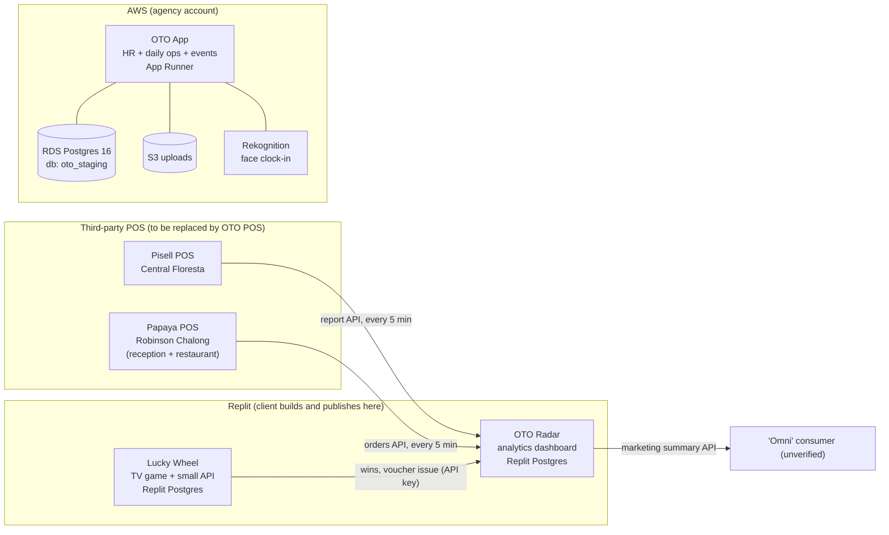

# Existing systems — verified picture (2026-09-19)

What OTO Play Park actually runs today, established by reading the three Replit
exports, the production schema and data dump, and their git histories. Full
evidence, with file and line references, is in
[`intake-2026-09-19/`](intake-2026-09-19/). Nothing here was taken on trust:
the claims the plan rests on were re-checked by hand in the code.

## The business, as the data shows it

- One tenant ("Default"), one operator ("Oto"), three branches: **Oto Play Park,
  Central Floresta**; **Oto Play Park, Robinson Chalong**; **Head Office**.
- 72 login users (6 admin, 14 manager, 51 staff, 1 advisor), 69 employees,
  12 departments (incl. Reception, Sales Booth, Childcare, Kitchen, Barista),
  12 job roles (incl. Nanny, Party Host, Reception, Sales Booth).

## Systems

| System | What it is | Where it runs | Database | State |
|---|---|---|---|---|
| **OTO App** ("OTO Suite") | HR, contracts + e-signature, timekeeping kiosks, scheduling and leave, payroll, tasks/checklists/ops board, SOPs + "Ask OTO", Fix reports, events/birthdays/BEO, camps, drop-off and nanny check-in, staff vouchers | AWS **App Runner** (Pulumi), not Kubernetes; the `k8s/` folder is a local dev rig | RDS Postgres 16, catalog `oto_staging` — **this is the live data** (activity up to the dump date, go-live about 2026-05-10) | Live, daily use. 184 tables (93 with data, ~46.8k rows). Still edited in Replit by the client (37 commits in the last 30 days) |
| **OTO Radar** ("OTO Intelligence") | Revenue analytics: sales sync from two POS systems, versioned revenue formulas, calendar/pace forecast/planner, AI chart assistant, events view, campaigns + QR vouchers, spin-wheel code ledger, visitor survey, Chalong tax invoices, accounting exports | **Replit** autoscale deployment (`oto-app-simple-fork`) | Replit Postgres (36 application tables). **We hold its structure only — no data** | Live, **publicly accessible with no login**. A fork of the OTO App codebase. 20 commits in the last 7 days |
| **Lucky Wheel** ("Spin & Win") | Portrait-TV wheel game driven by a USB button; phone voucher page; small Express API | Replit autoscale (`spingame`) | Its own Replit Postgres (`spin_wins`, `prize_claims`) | Live at the Floresta sales booth. Prizes and odds hard-coded in four places; outcome chosen in the browser; no printing yet |
| **POS** | — | — | — | **The client has no POS of its own.** Floresta sells through **Pisell**, Chalong through **Papaya**. The new OTO POS replaces both |

## How Radar gets its numbers

- **Floresta / Pisell** — one signed endpoint (`POST /openapi/report/gateway`)
  with report types for orders, line items, payments and wallet-pass usage.
  Synced every 5 minutes into raw tables, summarised per day into a cache stamped
  with a formula version (currently v30). Revenue = cash collected (payments −
  refunds − voucher redemptions), VAT-inclusive. Customer type, guest counts,
  categories and marketing source are **derived from product names, category
  titles, prices and voucher codes** — Pisell supplies no customer data.
- **Chalong / Papaya** — one endpoint (`GET /orders`) with a bearer token per
  outlet (park reception, restaurant). Fetched in 2-hour slices to work around a
  pagination bug. Revenue = order total on completed orders (VAT-inclusive,
  probably including the restaurant's service charge). No customer types, no
  voucher tracking, no party linking.
- **"Sales booth"** is not a data feed: it is a marketing-channel label derived
  from Pisell voucher codes and face values. There is no "voucher booth" entity.
- **Spin wheel** — the game's server pushes win events and asks Radar to issue a
  4-digit voucher code (API key). Reception redeems codes on Radar's public
  `/redeem` page. Codes never expire; 10,000-code lifetime ceiling.
- The browser merges the two branches itself and computes forecasts, targets,
  pace and holidays from hard-coded 2026 constants.
- History: Floresta from 2025-12-01, Chalong from early 2025. **Stored history
  has gaps** (Radar's own August 2026 audit: 6,502 of 7,686 Pisell orders
  stored), and the dev and published databases have diverged.

## What each system knows about people

| | Staff | Customers |
|---|---|---|
| OTO App | Full model: `users` (email or phone + password, scrypt), `people`, `employees`, roles, branch access, **per-user module switches** (11 module keys — enforced only in the UI) | **No customer table.** Parent and child details are free text on every visit: 2,038 service check-ins, 1,332 drop-off check-ins, 203 camp registrations, event bookings, RSVPs |
| Radar | None (vestigial copies of the OTO App tables, unused) | None — Pisell/Papaya supply no identities |
| Wheel | Shared PINs only | None — no phone, no limits, unlimited replays |

## Corrections to earlier assumptions

| Assumed | Actual |
|---|---|
| Radar pulls from Papaya, the park's POS | **Two** POS systems: Pisell (Floresta, the main pipeline) and Papaya (Chalong) |
| Production runs on Kubernetes | App Runner. The only AWS stacks are `dev` and `staging`; `staging` is the live system |
| Radar has a sales-booth and a voucher-booth feed | Neither exists. Booth = a derived marketing channel; the only pushed booth data is the wheel |
| The Radar schema file is a database dump | It is a structure listing that cannot be restored and contains no data, triggers or grants |
| Each app has its own admin and members | Only OTO App has real users and access control. Radar and the wheel have none |
| New platform will contain no biometrics | The live OTO App clocks 60 of 69 employees in by **face recognition** every day (8,116 clock events). The face templates live in the agency's AWS account and cannot be exported, so this must be decided before cutover |

## What we already hold — and what only the agency or the client holds

Assuming the agency provides nothing, we can still rebuild hosting ourselves: we
hold the Dockerfile, the full Pulumi definition of the AWS environment, every
environment-variable name, and database access (the owner produced the dump).

What lives only with the agency or in Replit Secrets:

- OTO App's `SESSION_SECRET`, `SESSION_PEPPER`, `KIOSK_CODE_PEPPER`,
  `PIN_FINGERPRINT_SECRET`. Without them: reprint the branch check-in QR posters,
  re-activate every kiosk tablet, reset advisor PINs. Everything else survives.
- The S3 bucket contents (signed contracts, photos, task evidence).
- The Rekognition face collections (not exportable in any case).
- DNS for the domains baked into issued links and QR codes.
- Radar's API credentials: Pisell (client id, secret, access token), Papaya (two
  tokens), the spin-wheel key, the marketing API key — all in Replit Secrets.
