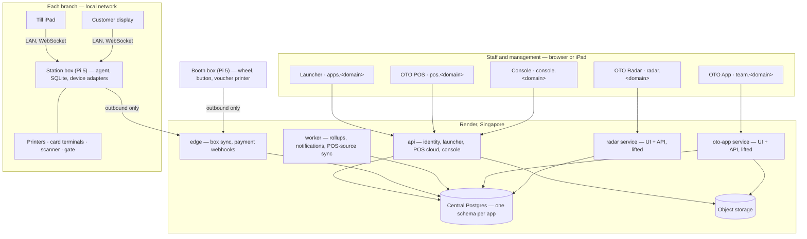
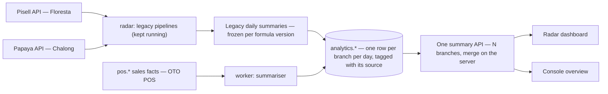

# OTO platform plan — one suite, one database, five apps

**Status:** proposed 2026-09-19, awaiting owner approval. Nothing here is built
yet. Basis: [`EXISTING_SYSTEMS.md`](EXISTING_SYSTEMS.md) (what runs today),
[`../briefs/PROJECT_CONTEXT.md`](../briefs/PROJECT_CONTEXT.md) (boxes, devices,
offline model) and [`../briefs/OWNER_DIRECTION.md`](../briefs/OWNER_DIRECTION.md).

**Sequencing update (same day):** the owner brought the POS and the booth
forward. Sprint 2 covers streams 1, 4 (launcher + Console v1), 5, 6, 7 and the
observability layer, deployed on Render temporary domains — see
[`../progress/SPRINT_2_PLAN.md`](../progress/SPRINT_2_PLAN.md). Streams 2, 3,
8 and 9 follow in Sprint 3. On temporary domains the sign-on in §4 is a signed
hand-off between apps rather than a parent-domain cookie; that hand-off is
the permanent mechanism and the cookie an optional shortcut later.

## 1. What we are building

A launcher page that lists the OTO apps a person may open, five apps behind one
sign-in, one central database, and Raspberry Pi boxes that run the counters.

| App | What it is | Where the code comes from | Approach |
|---|---|---|---|
| **Launcher** | Tiles for the apps the signed-in person may use; links out, nothing else | New | Build (small, static) |
| **OTO POS** | Till, customer display, back office, booking site, kiosk, gate | Sprint 1 platform + Replit prototype UI | **Build** — the only new product |
| **OTO App** | HR, contracts, timekeeping, scheduling, payroll, tasks, SOPs, events, camps, check-ins | Replit export (live system, 796 routes) | **Lift as-is** into our hosting, then integrate at the seams |
| **OTO Radar** | Revenue analytics, forecast, planner, events view, campaigns, tax invoices | Replit export (live system) | **Lift as-is**, then move its data layer onto the platform's analytics tables |
| **Booth** (lucky wheel) | TV game, printed vouchers, redemption, booth management | Replit export (UI pieces only) + specification v2 | **Rebuild** on the platform; reuse wheel, sound, styling |
| **Console** (super admin) | Users and permissions across all apps, branches, stations/boxes/booths, activity log, all-app analytics, system health | New | Build |

Why lift and not rewrite the two live apps: together they are roughly 50,000
lines of server logic (OTO App's routes and storage layer alone are 37,700; the
two Radar pipelines 11,800) with revenue-critical formulas and few unit tests,
and the client is still changing both weekly. A rewrite would fork from a moving
target and risk silent changes to the numbers management relies on. Their
coupling to Replit is shallow (a few environment names, a storage module, dev
plugins). Lifting gets them onto our hosting in days; integration then happens
at well-defined seams, and modules are absorbed later only where it pays.

## 2. Target shape

Deployment follows [`DEPLOYMENT_TOPOLOGY.md`](DEPLOYMENT_TOPOLOGY.md): many
small deployables, a subdomain per app, one parent domain. One refinement from
the intake: **each lifted app deploys as a single service that serves both its
UI and its API**, because its client makes ~660 same-origin relative `/api`
calls. Each runs as exactly one always-on instance (both keep in-process
timers), with `TZ=UTC`.

## 3. Central database

One PostgreSQL. One schema per app, one database login per service, each login
with its own connection limit and statement timeout.

| Schema | Owner service | Contents |
|---|---|---|
| `core` | api | Accounts, sessions, roles, permissions, app/module switches, tenant/operator/branch, devices (boxes, stations, booths, displays, kiosks), audit log, idempotency keys, files, settings |
| `crm` | api | Members, children, guardians, tier verifications, consents, contact channels |
| `pos` | api, edge | Catalogue, prices, tax, orders, lines, payments, refunds, wallets, bookings, bands, stock, cash management |
| `promo` | api, edge | Voucher definitions and instances, redemptions, campaigns, marketing channels |
| `booth` | api, edge | Booth config versions, prizes, spins, prints, heartbeats |
| `analytics` | worker (write), radar + api (read) | Daily summaries and facts from every source, targets, holidays, forecast settings, notes, locked periods |
| `oto_app` | oto-app | The 184 OTO App tables exactly as they are today |
| `radar` | radar | Radar's tables as they are today: Pisell/Papaya raw rows, caches, manual tables, campaigns, code ledgers |

Rules that keep the cutover simple and the apps independent:

- **Lifted schemas stay import-compatible.** Our changes to `oto_app` and
  `radar` are additive and applied by a re-runnable post-import script, so
  cutover is "load the fresh dump, run the script".
- **No foreign keys from platform tables into lifted schemas.** Links are soft
  keys. Legacy ids are UUID strings, so a person, branch or user keeps the *same
  id* in `core` and in `oto_app`.
- **Never run `drizzle-kit push` or the apps' reset scripts against the central
  database.** Push drops tables it does not know; the reset scripts drop the
  schema. Both apps move to generated SQL migrations inside their own schema.
- Radar's login needs a direct connection (it uses session-level advisory
  locks) and table ownership (it creates tables at runtime).

**Who is the master of each shared thing**

| Entity | Master | Others |
|---|---|---|
| Login accounts, roles, permissions | `core` (managed in the Console) | OTO App keeps a shadow `users` row per account with the same id — 127 of its foreign keys point there |
| Employees, HR records, schedules, time events | `oto_app` | POS and boxes read a staff directory mirrored into `core` |
| Branches, operators | `oto_app` at first (it holds the real ones), mirrored into `core`; the Console becomes the editor after cutover | All apps read `core` |
| Members, children, guardians | `crm` | OTO App check-ins, camps and events link to a member id instead of free text (additive columns) |
| Sales, payments, vouchers | `pos`, `promo` | OTO App's existing `pos_order_ref` / `pos_reference` fields become real links |
| Daily sales figures | `analytics` | Radar and the Console read them |

## 4. Sign-in, tokens and permissions

**One login for people, separate credentials for devices.**

| Who | Credential | Notes |
|---|---|---|
| Staff in any cloud app | One platform session — opaque id in an httpOnly cookie on the parent domain, stored hashed, revocable server-side | Sign in once at the launcher; every subdomain receives the cookie. Needs a real domain (`*.onrender.com` cannot share cookies) |
| Staff at a box | A short-lived signed staff token (shift-length expiry) minted from that session | The box verifies it offline with a public key, as the brief requires |
| Lifted apps | A small adapter placed before Passport validates the platform cookie against `core`, maps it to the local `users` row and calls `req.login()` | All 796 handlers keep working unchanged. Radar, which has no login at all today, gets the same adapter as a gate |
| Boxes, booths, kiosks, customer displays | One device credential each, issued by pairing, bound to a station, revocable in the Console | Replaces shared keys such as the wheel's single API key |
| Integrations | One API key per consumer, stored hashed | e.g. the external marketing-summary consumer |
| Customers | A separate realm (booking site, one-time codes) | Never receives the staff cookie; lives on a different domain |

Passwords: OTO App's scrypt hashes import as they are and are re-hashed with
argon2id on first sign-in, so nobody needs a reset at cutover.

**Permissions.** The platform's scoped permissions (`service:resource:action`
at tenant / operator / branch scope) remain the enforcement primitive. On top,
the Console offers what the client asked for — switching apps, modules and
sensitive features on or off per person and per branch:

- `app:<name>:access` decides which launcher tiles a person sees.
- Module switches map to permission bundles. OTO App's existing 11 module keys
  and per-user overrides are adopted as the starting vocabulary, and the Console
  writes them through to OTO App's own tables so its menus follow. (Today OTO
  App enforces modules on exactly one server route; real enforcement is added in
  the adapter.)
- Every state-changing request in every app is written to one audit log with
  person, app, branch, action and result. That is the "who did what" feed.

Because a parent-domain cookie makes every subdomain equally trusted, the
adapter also adds what the lifted apps lack today: an origin check on
state-changing requests, `SameSite=Lax`, secure cookies and security headers.

## 5. Analytics: history preserved, new sales flowing into the same totals

**The idea: one summary contract, three sources, a switch date per branch.**

Everything Radar shows — ranges, calendar, pace, planner, trends — is built from
*one summary per branch per day*. So continuity does not require converting old
orders into our order format. It requires that every day, from any source, ends
up as a row of the same shape.

- Each branch has a **source switch date**. Before it, the day comes from the
  legacy pipeline (`pisell` or `papaya`); from it onwards, from `oto_pos`.
  A range that spans the date simply adds rows — cumulative totals include all
  past history, which is the requirement.
- Radar's Pisell and Papaya sync **keeps running until that branch switches**,
  then stops for that branch. We do not rewrite the ingestion or the formulas;
  they retire by date.
- Legacy days are **frozen** once imported (no automatic rebuilds), because
  Radar's self-repair can overwrite a day with zeros when its raw rows are
  missing.

**Importing the history**

1. Restore a real dump of Radar's *published* database into `radar`: raw rows
   with their JSON, the daily caches, and the tables that exist nowhere else —
   birthday overrides, channel map, product-category overrides, targets and
   plans, calendar notes, locked months, campaigns, QR codes, the spin-code
   ledger, surveys.
2. Re-fetch every day from Pisell (from 2025-12-01) and Papaya (from 2025) into
   staging tables, one day at a time, and reconcile: stored vs re-fetched vs
   cached. Stored history is known to be incomplete (Radar's own August audit:
   6,502 of 7,686 orders). **This must happen while the API credentials still
   work — before anyone cancels Pisell or Papaya.**
3. Convert the reconciled days into `analytics` rows tagged with source and
   formula version. Keep the raw rows as the archive.

**What OTO POS must record so nothing is guessed any more.** Radar derives
customer type, guest counts, category and marketing channel from product names,
prices and voucher codes, because the third-party POS systems give it nothing
else. Our POS records them as facts:

| Fact | Fields that matter |
|---|---|
| Order | id, branch, station, staff, member, business date (Bangkok) + UTC timestamp, status, sales channel, party/event id |
| Line | own id, product, **revenue category and sub-category from the catalogue**, quantity, net / VAT / gross, discount, **kid count, adult count, stay duration, customer tier** |
| Payment | own id, method, amount, terminal reference, paid at |
| Refund | own row with its own timestamp (Pisell has none) |
| Voucher redemption | code, definition, campaign, **marketing channel**, amount, staff |

Decisions this raises, for the owner to confirm with the client:

- **Revenue definition.** Floresta today = cash collected, VAT-inclusive,
  excluding voucher redemptions. Chalong today = order total on completion.
  Proposal: OTO POS reports the Floresta definition as the headline (it is the
  larger branch and the better-defined number) and stores net, VAT and accrual
  figures as well, so accounting can have either view.
- **Branches become data, not code.** Radar is hard-wired for exactly two
  branches (the table family *is* the branch; the browser merges two results).
  The summary API takes N branches and merges on the server.
- Forecast constants, the holiday calendar (several 2026 lunar dates in the code
  look wrong), targets and notes move into `analytics` tables with a branch
  column, editable in the Console.

## 6. POS stations: till and customer display on separate devices

The prototype draws the staff screen and the customer screen side by side. In
the park they are two devices. The link between them is the **station session**,
owned by the box.

- A **station** = one box + one till + at most one customer display + its
  printers, terminal and scanner (as in the brief).
- The box holds one small **session document** per station: stage, cart, member,
  totals, payment state (including the QR to show), prompts awaiting the
  customer, language. The box is the only writer and stamps every change with a
  sequence number.
- The **till** sends actions to the box. The box applies them and pushes a
  **full snapshot** to both screens over a LAN WebSocket. Snapshots rather than
  patches: the document is small, and a screen that reconnects is correct again
  after one message. Nothing can drift.
- The **display** receives a *redacted view* computed by the box (no staff
  notes, no other customers' data) and can send only **intents** valid for the
  current stage: choose language, type a phone number, tick consent, sign.
- **Pairing.** A new display shows a short code. A manager claims it for a
  station from the till or the Console. The device stores a credential bound to
  that station; it survives restarts and can be revoked.
- **Failure rules.** The display is never on the critical path: if it drops,
  the till carries on and staff can enter the customer's input themselves. One
  active till per station; taking over needs a manager. A till that reloads
  rehydrates from the box. Latency is LAN-only — the internet is not involved.
- **Without hardware** (staging, demos, an admin at home) the same agent runs in
  the cloud as a **virtual box**, so till and display pair exactly the same way.
  A side-by-side view of both screens stays available for demos.

In code this is two routes of the same PWA (`/till`, `/display`) sharing the
session types from `packages/shared`.

## 7. Backend rules for speed and robustness

1. **Nothing at a counter waits on the internet.** Scan, sell, print, card
   payment, band check and child release are answered by the box from SQLite
   on the LAN.
2. **Facts are append-only and carry client-generated ids** (UUIDv7). Sales,
   payments, redemptions, spins and check-ins can be retried and re-sent any
   number of times; the cloud drops duplicates by id. There are no merge
   conflicts on facts.
3. **Mutable records are cloud-authoritative** (member profile, catalogue,
   config). Boxes receive them as versioned bundles or change feeds and apply a
   bundle whole or not at all.
4. **Scarce things are the exception** — single-use vouchers, wallet balance,
   daily prize caps. Online they are checked centrally through the box. Offline
   they follow the brief: capped wallet spend, local redemption log, and
   cross-station double use detected and flagged at sync.
5. **Sync is a queue with sequence numbers**, bounded batches, backoff with
   jitter and a resumable cursor. The cloud applies each batch in one
   transaction (this needs the transaction and service layer that Sprint 1
   lacks).
6. **Failure domains are separate services.** `edge` (boxes, webhooks) is
   deployed rarely and on purpose; `api` serves screens; `worker` does heavy
   work; each lifted app is its own service. Per-login database limits stop one
   app from starving the rest.
7. **Dashboards never read live sales tables.** The worker maintains the daily
   and hourly rows incrementally; a year for one branch is 366 small rows.
8. **Time is explicit.** `timestamptz` in UTC plus a business date computed once
   in Asia/Bangkok. A Pi has no clock battery: fit one or rely on NTP, and
   report clock skew in the heartbeat (a fast clock already breaks voucher
   issue in the current wheel).
9. **Every box reports** version, queue depth, last sync, printer and terminal
   state every 60 s. Silence raises an alert. Agent updates roll out one box,
   then one branch, then all, with rollback.

## 8. Booth (lucky wheel)

Rebuilt per the client's specification v2 (details in
[`../features/booth.md`](../features/booth.md)). In short: a booth is a station
type managed centrally; prizes, weights, expiry, daily caps and layout are a
versioned config cached on the booth box; the **box picks the outcome** (today
the browser does, and anyone can mint a voucher); every spin is recorded with
booth and staff; vouchers print on the ESC/POS printer with a 10-character
booth-prefixed code and QR; **redemption happens in the POS** with the staff
session, single use, server-validated. Outstanding legacy codes (4-digit spin
codes and campaign short codes — they never expire) are imported and remain
redeemable. The wheel graphics, spin animation, sound and kiosk hardening from
the current game are reused.

## 9. Console (super admin) — the fifth app

Scope now; detail decided later with the owner.

| Area | What it does |
|---|---|
| People and access | Accounts, roles, per-person app / module / feature switches, branch scope, sign-in history, force sign-out |
| Organisation | Operators, branches, opening hours |
| Devices | Boxes, stations (the setup wizard from the brief), booths, customer displays, kiosks: pairing, assignment, status, config version, remote test print |
| Activity | One feed across all apps: who did what, where, when, with filters by person, app and branch |
| Analytics | Headline figures from `analytics` for all branches and sources, booth funnel, attendance headline; deep analysis stays in Radar |
| Health | Services, box and booth heartbeats, sync lag per source, failed jobs, SMS and printer faults, alert channels |
| Integrations | Which keys are configured (never their values), API consumers, webhooks |

Domain settings stay with their app: catalogue, prices and tiers in the POS back
office; HR settings in OTO App; formulas and targets in Radar. The accounts,
roles and audit screens built in Sprint 1 move from the POS admin to the Console.

## 10. Security work done as part of the lift

The exports show live exposures. They are fixed in our copy as part of the
lift; the client may also want the agency to fix the worst in production now.

- **Radar:** no login on anything, including destructive sync and config
  routes. A public route sends the Pisell API secret and the dataset to any URL
  the caller supplies — remove the push/wipe routes and rotate the Pisell
  credentials.
- **OTO App:** a public lookup returns children's names, birth dates, photos and
  allergy notes by phone number; signed contract PDFs are served without login;
  kiosk clock endpoints accept any employee id; the credential vault stores
  passwords in plain text; response bodies are logged; the production database
  is reachable from the internet.
- **Wheel:** anyone can register a win and mint a voucher; codes are four
  digits and redemption is public.
- **All three repositories have real credentials in git history.** Everything is
  rotated at cutover; none of it enters our repository.

## 11. Environment variables to provision

Names only; values come from the owner into the hosting dashboard or a local
`.env`. Full per-app lists: [`oto-app.md`](../features/oto-app.md),
[`oto-radar.md`](../features/oto-radar.md), [`booth.md`](../features/booth.md).

| Group | Variables | Source |
|---|---|---|
| Every service | `DATABASE_URL` (its own login), `NODE_ENV`, `PORT`, `TZ=UTC`, `LOG_RESPONSE_BODY=false` | We create |
| Platform | session cookie domain and signing keys, staff-token key pair, band HMAC key, device-enrolment secret, object storage, `TWILIO_*`, 2C2P merchant id and secret, alert channel tokens, `SENTRY_DSN` | We create / vendor sandboxes |
| OTO App — required to boot | `APP_ENV`, `STORAGE_ENV_PREFIX`, `OBJECT_STORAGE` | We set |
| OTO App — continuity secrets | `SESSION_SECRET`, `SESSION_PEPPER`, `KIOSK_CODE_PEPPER`, `PIN_FINGERPRINT_SECRET`, `KIOSK_IDENTIFICATION_TOKEN_SECRET` | Agency, or new values + reprint QR posters, re-activate kiosks, reset advisor PINs |
| OTO App — services | `S3_BUCKET`, `AWS_REGION`, `AWS_ACCESS_KEY_ID`, `AWS_SECRET_ACCESS_KEY`, `PUPPETEER_EXECUTABLE_PATH`, `TWILIO_ACCOUNT_SID`, `TWILIO_AUTH_TOKEN`, `TWILIO_VERIFY_SERVICE_SID`, OpenAI key, `SMTP_*`, `HR_DIRECTORY_API_KEY`, `SENTRY_DSN` | Our own accounts |
| Radar — POS sources | `FUNTOPIA_CLIENT_ID`, `FUNTOPIA_CLIENT_SECRET`, `FUNTOPIA_ACCESS_TOKEN`, `PAPAYA_RECEPTION_TOKEN`, `PAPAYA_RESTAURANT_TOKEN` | **Replit Secrets — only the client has these** |
| Radar — other | `SPIN_WIN_REDEEM_KEY`, `OTO_RADAR_MARKETING_API_KEY`, OpenAI key | New values |

## 12. Workstreams, in dependency order

One continuous run; streams that do not depend on each other proceed in
parallel. Everything is demonstrable on staging against simulators before the
site visit.

| # | Stream | Depends on | Outcome |
|---|---|---|---|
| 0 | Inputs from the owner (§14) | — | Dumps, credentials, domain, decisions |
| 1 | **Platform foundation** — named schemas and per-service logins; transactions and a service layer; fix the role-assignment defect; client-supplied ids; shared sign-on package; signed staff token; device credentials; `render.yaml`; staging domain | — | The base every other stream stands on |
| 2 | **Lift OTO App** — vendor import, Docker service, `oto_app` schema from the dump, object storage, sign-on adapter, security fixes, clock-in decision applied, its own Playwright suite as the smoke test | 1 | OTO App on our hosting with a copy of live data |
| 3 | **Lift Radar** — vendor import, own schema, single instance, remove push/wipe, sign-on gate with the public pages exempted, history restore + re-fetch + reconciliation report | 1, Radar dump, POS credentials | Radar on our hosting with complete history |
| 4 | **Launcher + Console v1** — tiles by permission; people and access, organisation, activity feed, health | 1 | The front door and the control room |
| 5 | **Box agent, simulators, edge** — registration, heartbeat, cache, queue, sync, offline token check, station model, device adapters with wire-level simulators, virtual box | 1 | The brief's §14 step 1 |
| 6 | **POS on the platform** — replace the prototype's mock layer module by module: checkout, payments (terminals, 2C2P, cash), printing, bands and gate, bookings and redemption, supervision and release, wallets, F&B, stock, cash management, settlement export; till / display split | 5 | The brief's §14 steps 2–4 |
| 7 | **Booth** — booth agent role, game app, booth management, printing, spins log, POS redemption, legacy code import | 5, 6 (redemption) | Specification v2, both phases |
| 8 | **Analytics unification** — sales facts to `analytics`, one summary API, Radar's data layer switched over with parity tests against the frozen legacy days, Console overview, settings moved into tables | 3, 6 | One set of numbers, any number of branches |
| 9 | **Migration and cutover rehearsals** — re-runnable post-import scripts, schema-drift check against each fresh dump, member seeding from check-in history (optional), runbook | 2, 3 | Rehearsed until two runs match |

Messaging (LINE / WhatsApp / Instagram), kiosk and gate follow the brief inside
streams 5–6.

**The lifted apps stay in step with Replit until cutover.** Both are edited by
the client weekly. Each is vendored under `apps/` with our changes kept to a
small, separate patch set, so a fresh export can be re-imported by diff. At
cutover Replit editing of the production code stops; from then on changes are
made in this repository.

## 13. Cutover

- **Stage A — the existing suite moves (no park hardware needed).** Final dump
  of the agency database → load into `oto_app` → post-import script → DNS points
  to our services. Radar and the wheel move the same way. One switch per app,
  rehearsed beforehand; the agency system stays untouched as the fallback.
- **Stage B — OTO POS replaces Pisell / Papaya, branch by branch,** after the
  site visit has brought the real devices up. On a branch's switch date its
  analytics source flips; the other branch keeps syncing from its old POS.

This honours "one switch, no long parallel sync" for the systems that exist
today, and accepts that a new POS at a counter is an on-site event. Doing both
stages in one weekend is possible but couples a low-risk hosting move to a
high-risk operational change; the owner decides.

Staging holds a copy of real staff and children's data: it sits behind the
sign-on, with outbound SMS and email disabled.

## 14. Needed from the owner

**Data and access**
1. A `pg_dump -Fc` of the OTO App database (the brief says RDS access exists).
2. A real dump of **Radar's published database** and of the **wheel's
   database** — the Radar file we hold has structure only.
3. The Pisell, Papaya, spin-key, marketing-key and OpenAI values from Replit
   Secrets (into `.env` / the hosting dashboard only), **and an agreement that
   Pisell and Papaya are not cancelled until the history export is done.**
4. A copy of the S3 buckets (contracts, photos, task evidence) or AWS access.
5. Who controls DNS for `otoplay.org`, `otoplay.dev`, `otoplay.co`. Keeping the
   existing hostnames means issued links and printed QR codes keep working.
6. Whether the agency will hand over the five OTO App continuity secrets.
7. Render account (paid plan), the staging domain, vendor device documents.

**Decisions**
1. **Staff clock-in.** The live system clocks 60 of 69 employees in by face
   recognition; the brief bans biometrics, and the face templates sit in the
   agency's AWS account and cannot be exported. Either (a) switch to the
   existing PIN / phone + photo fallback at cutover, later a staff QR badge —
   recommended, and consistent with the brief; or (b) keep face clock-in in our
   own AWS account and re-enrol every employee.
2. **Revenue definition** for OTO POS (§5).
3. **Who owns supervised care.** The brief wants check-in and release to work
   offline on the box; OTO App runs drop-off and nanny check-ins in the cloud
   today (3,370 visits). Proposal: the platform owns the new flow, OTO App's
   history is imported, its board is retired per branch at Stage B.
4. Cutover shape: Stage A then B (recommended), or everything at once.
5. Replit change freeze at cutover, and how the client requests changes after.
6. What "Omni" / the Marketing Hub is, since it consumes Radar's summary API.
7. Spin eligibility: the brief says one spin per band or phone; the client's
   latest wording says no phone capture. Proposed default: per-booth setting,
   off for mall booths.
8. Seeding members from OTO App's check-in history (deduplicated by phone,
   marked unverified) — yes or no.
